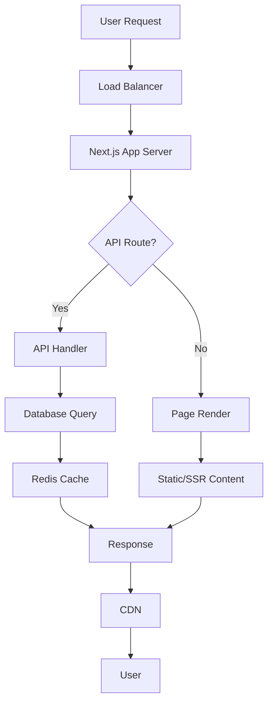

# Production-Ready React Web Application Plan

## Overview
Create a full-stack React web application using Next.js for server-side rendering, optimized for handling thousands of concurrent users. The app will include authentication, database integration, caching, and monitoring.

## Architecture
- **Frontend**: Next.js (React framework with SSR/SSG)
- **Backend**: Next.js API routes (Node.js/Express)
- **Database**: PostgreSQL
- **Authentication**: JWT with refresh tokens
- **Caching**: Redis for session and data caching
- **Deployment**: Docker containers with Kubernetes orchestration
- **Monitoring**: Prometheus and Grafana
- **Security**: HTTPS, rate limiting, CORS, input validation

## Key Features for Scalability
- Server-side rendering for better performance and SEO
- Code splitting and lazy loading
- Database connection pooling
- Horizontal scaling with load balancers
- CDN for static assets
- Error boundaries and graceful error handling
- Comprehensive logging and monitoring

## Workflow Diagram

## Security Considerations
- JWT authentication with secure storage
- Rate limiting to prevent abuse
- Input sanitization and validation
- HTTPS everywhere
- CORS configuration
- Environment variable management

## Performance Optimizations
- Image optimization with Next.js Image component
- Bundle analysis and optimization
- Database query optimization
- Caching strategies (browser, server, CDN)
- Compression (gzip/brotli)